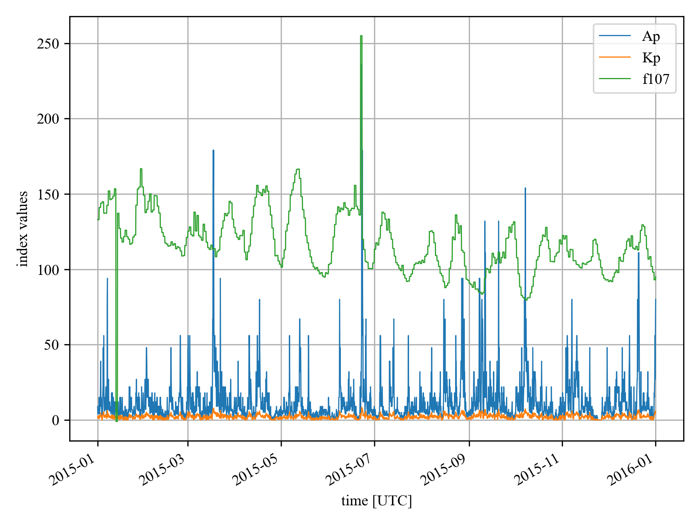

# Geomagnetic Data Indices

Geomagnetic indices downloader and parser, returns Ap, F10.7 (raw and averaged) and Kp.

This is derived from [geomagindices](https://pypi.org/project/geomagindices/), and has been modified to:

- Correctly return averaged F10.7 values centered around the requested time.
- Support the new [post-SWPC data sources for all data dating back to 1932](ftp://ftp.gfz-potsdam.de/pub/home/obs/Kp_ap_Ap_SN_F107/).
- Fix a bug where averaging would not cross year boundaries.
- Handle timezone-aware inputs correctly.
- Return storm-time Ap indices for MSIS-xx models.

It is a drop-in replacement for [geomagindices](https://pypi.org/project/geomagindices/).

Output datatype is
[pandas.DataFrame](http://pandas.pydata.org/pandas-docs/stable/reference/frame.html)
(for multiple times)

internally, uses
[pandas.Index.get_loc](https://pandas.pydata.org/pandas-docs/stable/reference/api/pandas.Index.get_loc.html)
to find nearest time to request.

Missing data is returned as `NaN` (Not a Number floating point value).

## Installation
Direct installation:
```sh
$ pip install geomagdata
```

Indirect installation:
```sh
$ git clone https://github.com/sunipkm/geomagdata
$ cd geomagdata
$ pip install .
```

## Examples

Use from other programs like

```python
import geomagdata as gi

inds = gi.get_indices(date)
```

`date` can be a single value, or a sequence/array/`pandas.DatetimeIndex`.
A single value can be an ISO date/time string; Python's
[`datetime.date`/`datetime.datetime`](https://docs.python.org/3/library/datetime.html);
[`numpy.datetime64`](https://numpy.org/doc/stable/reference/arrays.datetime.html); or a
[`whenever`](https://whenever.readthedocs.io/) `Instant`/`ZonedDateTime`/`OffsetDateTime`/`PlainDateTime`/`Date`.

A `whenever` exact-instant type (`Instant`, `ZonedDateTime`, `OffsetDateTime`) is always
resolved to true UTC. A plain `datetime`/`PlainDateTime` is treated as naive UTC by
default; pass `tzaware=True` if it carries its own timezone/offset that should be
converted to UTC first.

---

```sh
python examples/plotindices.py 2015-01-01 2016-01-01
```


